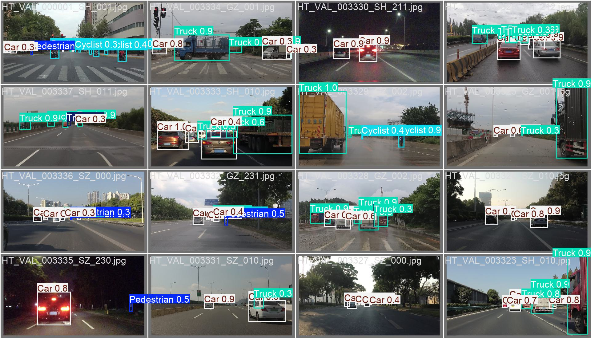

# 基于YOLO11的目标检测系统
本项目使用YOLO11训练用于目标检测的模型,具体地,我们使用SODA数据集,训练了yolo11n和yolo11s两个模型,模型具体训练过程如下:

## 项目目录
```angular2html
├─ auto_vehicle
    ├─ dataset # 数据集
        └─ soda
            ├─ images
                ├─ train
                    ├─ *.jpg
                ├─ val
                    ├─ *.jpg
            ├─ labels
                ├─ train
                    ├─ *.txt
                ├─ val
                    ├─ *.txt
            ├─ soda.yaml
    ├─ runs # 训练结果,训练过程自动生成
    ├─ wandb # wandb日志,训练过程自动生成
    ├─ convert_coco2yolo.py
    ├─ finetune.py
    ├─ readme.md
```

## Environment
1. 安装Python3.8以上版本, 安装Pytorch1.8以上版本
2. 安装ultralytics包
```bash
pip install ultralytics
```

[//]: # (Pip install the ultralytics package including all requirements in a Python>=3.8 environment with PyTorch>=1.8.)
[//]: # (Then isntall the ultralytics package with the following command:)

## 项目初始目录结构
```angular2html
├─ auto_vehicle
    ├─ convert_coco2yolo.py
    ├─ finetune.py
    ├─ readme.md
    ├─ soda.yaml
```

## 数据集准备 Dataset
1. 进入auto_vehicle目录,创建dataset文件夹,下载SODA数据集 [SODA数据集](https://soda-2d.github.io/download.html),下载SODA10M Trainval和SODA10M Test数据集,并解压到dataset文件夹下,其目录结构如下
```angular2html
├─  dataset
    ├─  SSLAD-2D
        ├─  Labeled
            ├─  train
            ├─  val
            ├─  test
            ├─  annotations
                ├─  instance_train.json
                ├─  instance_val.json
                ├─  instance_test.json
```
2. 执行以下命令,将coco格式的数据集转换为yolo格式, 请将convert_coco2yolo.py中的数据集annotations文件夹路径修改为自己的数据集中annotations路径,执行结束后,在dataset目录下会生成soda文件夹,
```bash
python convert_coco2yolo.py
```
3. 将SSLAD-2D/Labeled/train,val,test文件夹移动到soda/images目录下,将项目文件夹下soda.yaml文件移动到soda/images文件夹下
4. 删除SSLAD-2D文件夹
5. 重命名labels文件夹下instance_train为train, instance_val为val, instance_test为test,至此,数据集准备完成,最终dataset结构如下:
```angular2html
├─  dataset
    ├─  soda
        ├─  images
            ├─  train
            ├─  val
            ├─  test
        ├─  labels
            ├─  train
            ├─  val
            ├─  test
        ├─  soda.yaml
```

## Command
训练模型
```bash
# training for yolo11s
python finetune.py --data ./dataset/soda/soda.yaml --model yolo11s --epochs 100 --batch 32 --imgsz 640 
# training for yolo11n
python finetune.py --data ./dataset/soda/soda.yaml --model yolo11n --epochs 100 --batch 32 --imgsz 640 
```

[//]: # (epoch,time,train/box_loss,train/cls_loss,train/dfl_loss,metrics/precision&#40;B&#41;,metrics/recall&#40;B&#41;,metrics/mAP50&#40;B&#41;,metrics/mAP50-95&#40;B&#41;,val/box_loss,val/cls_loss,val/dfl_loss,lr/pg0,lr/pg1,lr/pg2)
## Result
### YOLO11n

[//]: # (                 Class     Images  Instances      Box&#40;P          R      mAP50  mAP50-95&#41;: 100%|██████████| 312/312 [01:39<00:00,  3.13it/s])

[//]: # (                   all       4991      37046      0.226      0.152      0.153     0.0892)

[//]: # (                person        832       2835      0.368      0.301      0.221      0.112)

[//]: # (               bicycle       1208       2616      0.297     0.0283     0.0798     0.0269)

[//]: # (                   car       4711      20611      0.687       0.56      0.609      0.392)

[//]: # (            motorcycle       3307       9501    0.00219   0.000105     0.0059     0.0031)

[//]: # (              airplane       1084       1387          0          0    0.00242    0.00141)

[//]: # (                   bus         76         96    0.00134     0.0208   0.000336   0.000193)
| Class      | Images  | Instances | P     | R     | mAP50  | mAP50-95  |
|------------|---------|-----------|-------|-------|--------|-----------|
| all        | 4991    | 37046     | 0.226 | 0.152 | 0.153  | 0.089     |
| person     | 832     | 2835      | 0.368 | 0.301 | 0.221  | 0.112     |
| bicycle    | 1208    | 2616      | 0.297 | 0.028 | 0.079  | 0.026     |
| car        | 4711    | 20611     | 0.687 | 0.56  | 0.609  | 0.392     |
| motorcycle | 3307    | 9501      | 0.002 | 0.000 | 0.005  | 0.003     |
| airplane   | 1084    | 1387      | 0     | 0     | 0.002  | 0.001     |
| bus        | 76      | 96        | 0.001 | 0.02  | 0.000  | 0.000     |

### YOLO11n_finetune
| Class      | Images  | Instances | P     | R     | mAP50  | mAP50-95  |
|------------|---------|-----------|-------|-------|--------|-----------|
| all        | 4991    | 37046     | 0.574 | 0.44  | 0.47   | 0.3       |
| Pedestrian | 832     | 2835      | 0.614 | 0.279 | 0.355  | 0.164     |
| Cyclist    | 1208    | 2616      | 0.631 | 0.52  | 0.552  | 0.314     |
| Car        | 4711    | 20611     | 0.734 | 0.716 | 0.761  | 0.543     |
| Truck      | 3307    | 9501      | 0.673 | 0.559 | 0.598  | 0.397     |
| Tram       | 1084    | 1387      | 0.613 | 0.387 | 0.437  | 0.315     |
| Tricycle   | 76      | 96        | 0.177 | 0.177 | 0.117  | 0.064     |

### YOLO11s

[//]: # (                 Class     Images  Instances      Box&#40;P          R      mAP50  mAP50-95&#41;: 100%|██████████| 312/312 [01:39<00:00,  3.13it/s])

[//]: # (                   all       4991      37046      0.223      0.177      0.173      0.103)

[//]: # (                person        832       2835      0.386      0.401      0.276      0.145)

[//]: # (               bicycle       1208       2616      0.207     0.0297     0.0764     0.0235)

[//]: # (                   car       4711      20611      0.742      0.622      0.677      0.447)

[//]: # (            motorcycle       3307       9501    0.00145   0.000105    0.00696    0.00323)

[//]: # (              airplane       1084       1387          0          0    0.00162    0.00119)

[//]: # (                   bus         76         96   0.000885     0.0104   0.000488   0.000287)
| Class      | Images  | Instances | P     | R     | mAP50  | mAP50-95  |
|------------|---------|-----------|-------|-------|--------|-----------|
| all        | 4991    | 37046     | 0.223 | 0.177 | 0.173  | 0.103     |
| person     | 832     | 2835      | 0.386 | 0.401 | 0.276  | 0.145     |
| bicycle    | 1208    | 2616      | 0.207 | 0.029 | 0.076  | 0.023     |
| car        | 4711    | 20611     | 0.742 | 0.622 | 0.677  | 0.447     |
| motorcycle | 3307    | 9501      | 0.001 | 0.000 | 0.006  | 0.003     |
| airplane   | 1084    | 1387      | 0     | 0     | 0.001  | 0.001     |
| bus        | 76      | 96        | 0     | 0.01  | 0      | 0        |

### YOLO11s_finetune

[//]: # (                 Class     Images  Instances      Box&#40;P          R      mAP50  mAP50-95&#41;: 100%|██████████| 312/312 [01:39<00:00,  3.14it/s])

[//]: # (                   all       4991      37046      0.701      0.472       0.54      0.356)

[//]: # (            Pedestrian        832       2835      0.757      0.311      0.442      0.225)

[//]: # (               Cyclist       1208       2616      0.727      0.543       0.62      0.371)

[//]: # (                   Car       4711      20611      0.845       0.73      0.808      0.595)

[//]: # (                 Truck       3307       9501      0.764      0.563      0.646      0.438)

[//]: # (                  Tram       1084       1387      0.746      0.433      0.522      0.393)

[//]: # (              Tricycle         76         96      0.367       0.25      0.205      0.116)
| Class      | Images  | Instances | P     | R     | mAP50  | mAP50-95  |
|------------|---------|-----------|-------|-------|--------|-----------|
| all        | 4991    | 37046     | 0.701 | 0.472 | 0.54   | 0.356     |
| Pedestrian | 832     | 2835      | 0.757 | 0.311 | 0.442  | 0.225     |
| Cyclist    | 1208    | 2616      | 0.727 | 0.543 | 0.62   | 0.371     |
| Car        | 4711    | 20611     | 0.845 | 0.73  | 0.808  | 0.595     |
| Truck      | 3307    | 9501      | 0.764 | 0.563 | 0.646  | 0.438     |
| Tram       | 1084    | 1387      | 0.746 | 0.433 | 0.522  | 0.393     |
| Tricycle   | 76      | 96        | 0.367 | 0.25  | 0.205  | 0.116     |

## 可视化结果
### yolo11s训练结果

### yolo11n训练结果

### yolo11s定性分析

### yolo11n定性分析

### 定性分析标签

## predict
使用自己的图片进行推理
```
python predict.py --img_path ./assets/images.jpg --model runs/detect/yolo11n_e100/weights/best.pt --save True --imgsz 640 --device 0 --conf 0.5
```

 

## 说明
本项目在window 11系统进行数据集的处理,并在ubuntu环境下使用单卡2080ti进行训练.为了上传代码的简洁,模型权重,wandb下的日志文件均保存在百度网盘链接中,见[百度网盘链接](www.baidu.com).